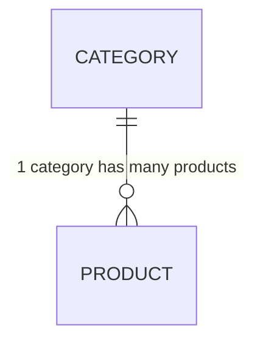
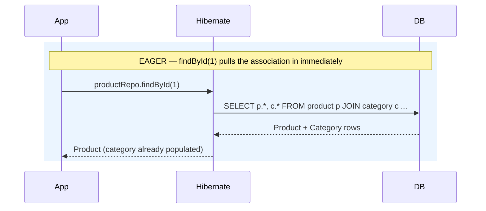
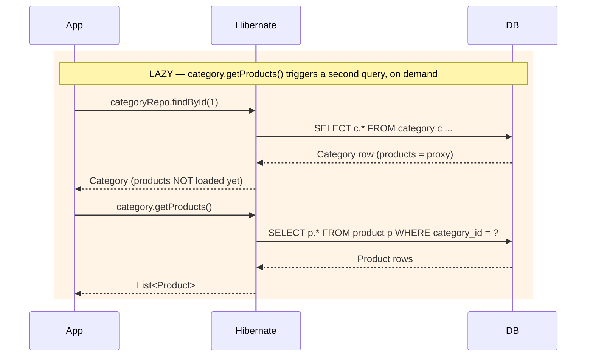
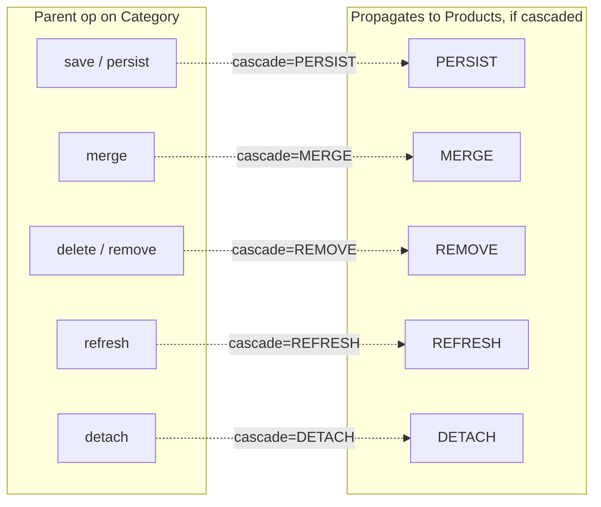

# Fetch Types and Cascade Types (JPA / Hibernate)

Notes expanding on "FetchTypes and Nodes.pdf", combining Fetch Types (covered in the PDF) with Cascade Types (listed on the agenda as `Mapped By -> Cascade Types` but not detailed there). Examples reference the actual `Product` / `Category` entities in `springboot-ProductCatalog`.

> **TL;DR**
> - **Fetch type** = *when* related data is loaded (now vs. on-demand).
> - **Cascade type** = *whether* an operation on the parent also happens to its children.
> - They are independent knobs — set them separately, for different reasons.

## Contents

1. [Recap: Cardinalities & `mappedBy`](#1-recap-cardinalities--mappedby)
2. [Fetch Types](#2-fetch-types)
3. [Cascade Types](#3-cascade-types)
   - [3.1 `orphanRemoval` vs. `CascadeType.REMOVE`](#31-orphanremoval-vs-cascadetyperemove)
4. [Quick Mental Model](#4-quick-mental-model)
5. [References](#5-references)

---

## 1. Recap: Cardinalities & `mappedBy`



| Side | Entity | Annotation | Role |
|---|---|---|---|
| **Owning** | `Product` | `@ManyToOne` | Holds the FK column `category_id` |
| **Inverse** | `Category` | `@OneToMany(mappedBy = "category")` | Mirrors the relationship, no FK |

```java
// Product.java — owning side
@ManyToOne
private Category category;   // holds the FK (category_id)

// Category.java — inverse side
@OneToMany(mappedBy = "category")
List<Product> products;      // no FK, just mirrors the relationship
```

> **`mappedBy` marks the inverse side.** It tells Hibernate: *"don't create a join column/table for this side — `Product.category` already owns the FK."*

> [!WARNING]
> **Only the owning side's changes are flushed to the FK column.** Mixing up owning vs. inverse is the #1 cause of "why isn't my relationship saving/updating?" bugs.

---

## 2. Fetch Types

```java
@ManyToOne(fetch = FetchType.EAGER)   // default for *ToOne
@OneToMany(fetch = FetchType.LAZY)    // default for *ToMany
```

| Association | Default | Meaning |
|---|:---:|---|
| `@ManyToOne` | `EAGER` | loaded immediately, in the same query |
| `@OneToOne` | `EAGER` | loaded immediately, in the same query |
| `@OneToMany` | `LAZY` | loaded only when accessed |
| `@ManyToMany` | `LAZY` | loaded only when accessed |

**Rule of thumb:** single-valued (`*ToOne`) associations default to **EAGER**; collections (`*ToMany`) default to **LAZY**.

### EAGER vs. LAZY, side by side





### Why this matters in practice

| Pitfall | Cause | Fix |
|---|---|---|
| Slow `findById` with several joins | `EAGER` on relationships you don't always need | Default to `LAZY`, opt in per-query |
| `LazyInitializationException` | `LAZY` collection accessed **after** the transaction/session closed (e.g. in a controller touching `category.getProducts()` post-repository-call) | Fetch what you need *inside* the transaction |
| N+1 selects | Looping over parents and lazily touching each child collection | Use `JOIN FETCH` (below) instead of flipping to `EAGER` everywhere |

> **Recommendation:** be explicit rather than relying on the default — e.g. `@ManyToOne(fetch = FetchType.LAZY)` on `Product.category` if the category isn't always needed.

To load the association eagerly **for one query only**, without changing the mapping's default, use `JOIN FETCH`:

```java
@Query("select p from Product p join fetch p.category where p.id = :id")
Product findByIdWithCategory(@Param("id") Long id);
```

> [!NOTE]
> **Switching every relationship to `EAGER` is not a real fix for N+1** — it just moves the extra selects earlier (or turns them into a join), and stacking `EAGER` across *multiple* collections on the same entity risks a Cartesian-product blow-up in the result set. `JOIN FETCH` / entity graphs, scoped to the query that actually needs the data, are the targeted fix.

<details>
<summary><strong>Aside — FetchType vs. FetchMode (easy to conflate)</strong></summary>

| | Answers | Values |
|---|---|---|
| `FetchType` | **When** — eager (now) or lazy (on access)? | `EAGER`, `LAZY` |
| `FetchMode` *(Hibernate-specific)* | **How** — one query with a join, or a separate select/subselect? | `JOIN`, `SELECT`, `SUBSELECT` |

`FetchType` is the JPA-portable timing knob used throughout this doc; `FetchMode` is a Hibernate-only strategy knob for *how* the fetch is executed. Most day-to-day tuning only needs `FetchType` + `JOIN FETCH`.
</details>

---

## 3. Cascade Types

Cascading controls whether an operation performed on the **parent/owning** entity propagates to its **associated** entities. Declared via the `cascade` attribute:

```java
@OneToMany(mappedBy = "category", cascade = CascadeType.ALL)
List<Product> products;
```

> **Without `cascade`, saving/deleting a `Category` has *no effect* on its `Product`s** — each `Product` must be persisted/removed individually.



| `CascadeType` | Triggering operation | Effect on `Product`s |
|---|---|---|
| `PERSIST` | `save()` / `persist()` | New transient products get inserted along with the category |
| `MERGE` | `merge()` | Changes on detached products get merged along with the category |
| `REMOVE` | `delete()` / `remove()` | Products get deleted along with the category |
| `REFRESH` | `refresh()` | Products get reloaded from the DB along with the category |
| `DETACH` | `detach()` | Products get detached from the persistence context along with the category |
| `ALL` | *(any of the above)* | Shorthand for all five |

### 3.1 `orphanRemoval` vs. `CascadeType.REMOVE`

These two look interchangeable but answer **different questions** — easy to mix up, worth its own mental box:

| | Triggered by | Typical use |
|---|---|---|
| `CascadeType.REMOVE` | **Deleting the parent** (`categoryRepository.delete(category)`) | "When the category goes, so do its products." |
| `orphanRemoval = true` | **Unlinking the child from the collection** — removing it from the list *or* reassigning it, even if the parent is untouched | "A product with no category left doesn't deserve to exist." |

```java
@OneToMany(mappedBy = "category", orphanRemoval = true)
List<Product> products;
```

```java
// parent Category is NOT deleted here — yet this alone deletes the Product row
category.getProducts().remove(someProduct);
```

> [!TIP]
> `orphanRemoval = true` fires on **disassociation**, not just on parent deletion — so it also covers (and effectively implies) the `REMOVE` case. Reach for it on true composition relationships (child is nothing without this exact parent, e.g. `Order` → `OrderItem`). For `Category` → `Product`, a product should almost never vanish just because it was moved out of a list, so leave `orphanRemoval` **off** here.

### Cascade vs. the FK-constraint question (PDF, page 2)

> *"If we delete the Category, what happens to its Products?"*

| # | Option | JPA-level equivalent | DB-level equivalent |
|:---:|---|---|---|
| 1 | **Not allowed** — the delete is blocked | no cascade set | FK `ON DELETE RESTRICT` *(default)* |
| 2 | **Orphan the products** — `category_id` set to `NULL` | don't cascade `REMOVE`; column must be nullable | FK `ON DELETE SET NULL` |
| 3 | **Delete the products too** | `CascadeType.REMOVE` (or `ALL`) | FK `ON DELETE CASCADE` |

> [!IMPORTANT]
> **Cascade types are a JPA/ORM-level behavior only** — they apply solely through the `EntityManager`/repository (e.g. `categoryRepository.delete(category)`).
> A raw `DELETE FROM categories WHERE id = ?` bypasses Hibernate entirely and obeys the **database's FK constraint** instead, not your `@OneToMany` cascade setting.
> **Keep them aligned:** decide the rule at the DB level (`RESTRICT` / `SET NULL` / `CASCADE`) and mirror it in the entity mapping.

### Applying it to `Category` / `Product`

`Category` currently has no `cascade` set:

```java
@OneToMany(mappedBy = "category")
List<Product> products;
```

| Scenario | Current behavior | Notes |
|---|---|---|
| Delete a `Category` with existing `Product`s | Fails with an FK constraint violation *(option 1)* | ...unless the column is nullable and the schema handles it differently |
| Add `cascade = REMOVE` / `ALL` | Deletes all of a category's products *(option 3)* | Usually **not** desired here — products are meaningful independent of their category |
| Add `cascade = PERSIST` | Saving a new category also inserts its new products in one call | The most broadly useful option for this relationship |

> **Rule of thumb:** `CascadeType.ALL` fits a true parent-owns-child composition, where the child has no meaning without the parent (e.g. `Order` → `OrderItem`). `Category` → `Product` is more of a shared/reference relationship, so a blanket `ALL` is risky — prefer picking individual cascade types (`PERSIST`) deliberately.

---

## 4. Quick Mental Model

| Question | Answered by |
|---|---|
| *When I load this entity, do I also load its related data right now, or only when I ask for it?* | **Fetch type** (`EAGER` / `LAZY`) |
| *When I persist / merge / remove / refresh / detach this entity, should the same operation also happen to its related entities?* | **Cascade type** |

Because the two knobs are independent, any combination is valid:

| | No cascade | `CascadeType.ALL` |
|---|---|---|
| **`LAZY`** | Load nothing extra, touch nothing extra | Load nothing up front, but every write ripples through |
| **`EAGER`** | Load everything up front, touch nothing extra | Load everything up front, and every write ripples through |

---

## 5. References

- [Overview of JPA/Hibernate Cascade Types — Baeldung](https://www.baeldung.com/jpa-cascade-types)
- [Eager/Lazy Loading in Hibernate — Baeldung](https://www.baeldung.com/hibernate-lazy-eager-loading)